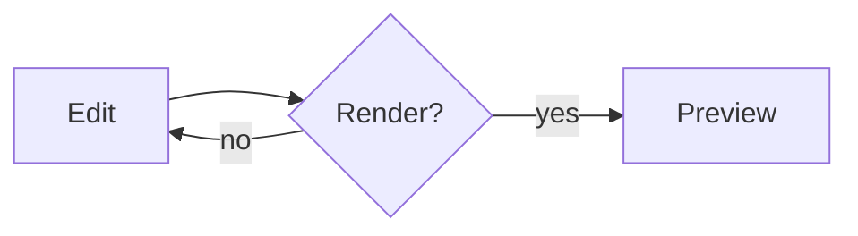

# Live Markdown + Mermaid

Type on the *left*; the preview on the **right** renders prose,
tables, and mermaid diagrams as you edit. The ```mermaid block
below is syntax-highlighted in the editor and drawn in the preview.

## A diagram



## A table

| Feature   | Live |
|-----------|:----:|
| Highlight |  ✎   |
| Diagram   |  ▢   |
