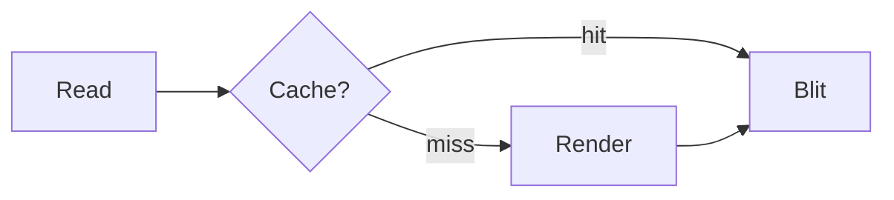
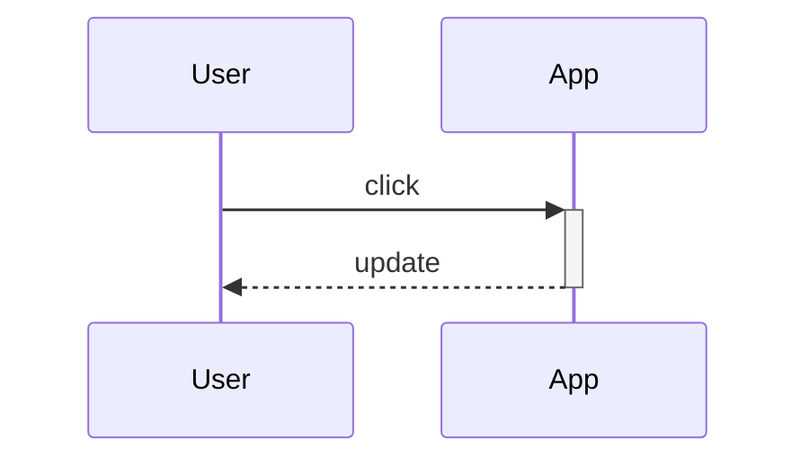

# Markdown, Extended

`MarkdownExtendedViewer` renders standard Markdown **plus** embedded
`mermaid` diagrams — fenced ` ```mermaid ` blocks are drawn as box graphics
instead of shown as source.

## A flowchart



Everything between diagrams is normal Markdown: lists,

- bold / _italic_ text,
- links, block-quotes,
- and syntax-highlighted code that is **not** a diagram:

```csharp
var viewer = new MarkdownExtendedViewer(File.ReadAllText("doc.md"));
```

## A sequence diagram



Scroll with the arrows, PgUp/PgDn, Home/End, or the mouse wheel.
